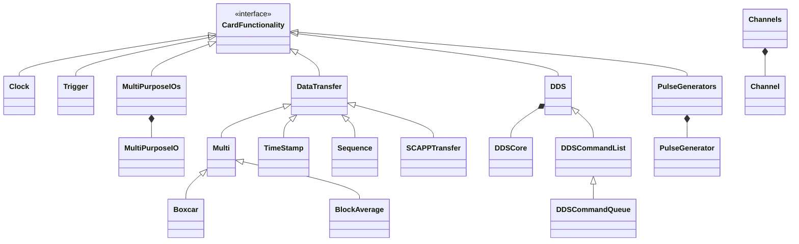

A high-level, general purpose, object-oriented Python package to control Spectrum Instrumentation GmbH devices.

`spcm` can connect to digitizers, AWGs, StarHubs and Netboxes. The package contains classes for controlling specific
cards and synchronization devices (StarHub) as well as for specific functionality, such as DDS and TimeStamps. 

# Classes

## Hardware classes

Hardware classes are the interfaces to the actual devices. These hardware classes support context management, hence the opening of specific devices is handled as a file open, using the Python with-statement.

| Name        | Parent      | Description                                                                                                                                    |
|-------------|-------------|------------------------------------------------------------------------------------------------------------------------------------------------|
| `Device`    | (none)      | general base class for connecting to Spectrum Instrumentation GmbH devices and an interface for other classes.                                 |
| `Card`      | `Device`    | a class to control the low-level API interface of Spectrum Instrumentation cards.                                                              |
| `Sync`      | `Device`    | a class for controling StarHub devices.                                                                                                        |
| `CardStack` | `ExitStack` | a class that handles the opening and closing of a combination of different cards either with or without a StarHub that synchronizes the cards. |
| `Netbox`    | `CardStack` | a class that handles the opening and closing of a group of cards combined in a Netbox.                                                         |

### Diagram

## Functionality classes

Functionality classes handle specific functionality that is available to the card, as well as specific add-on options. A functionality class is provided with a hardware class object to handle functionality on that card. Some classes, in addition, also support groups of cards and can be provided with objects of type `CardStack`.

| Name                | Parent              | Description                                                                                   |
|---------------------|---------------------|-----------------------------------------------------------------------------------------------|
| `CardFunctionality` | (none)              | interface class for additional card functionality                                             |
| `Channels`          | (none)              | class for controlling the channels of a card or a stack of cards                              |
| `Channel`           | (none)              | class for controlling a single channel                                                        |
| `Clock`             | `CardFunctionality` | class for setting up the clock engine of the card                                             |
| `Trigger`           | `CardFunctionality` | class for setting up the trigger engine of the card                                           |
| `MultiPurposeIOs`   | `CardFunctionality` | class for setting up the multi purpose i/o's of the card                                      |
| `MultiPurposeIO`    | (none)              | class for handling a single multi purpose i/o line a list of these objects resides inside `MultiPurposeIOs` |
| `DataTransfer`      | `CardFunctionality` | special class for handling data transfer functionality                                        |
| `Multi`             | `DataTransfer`      | special class for handling multiple recording and replay mode functionality                   |
| `Sequence`          | `DataTransfer`      | special class for handling sequence mode functionality                                        |
| `TimeStamp`         | `DataTransfer`      | special class for handling time stamped data                                                  |
| `SCAPPTransfer`     | `DataTransfer`      | special class for handling direct card to GPU class using the SCAPP option                    |
| `Boxcar`            | `Multi`             | special class for handling boxcar averaging                                                   |
| `BlockAverage`      | `Multi`             | special class for handling block averaging functionality                                      |
| `PulseGenerators`   | `CardFunctionality` | class for handling the pulse generator functionality                                          |
| `PulseGenerator`    | (none)              | class for handling a single pulse generator a list of these objects resides inside `PulseGenerators` |
| `DDS`               | `CardFunctionality` | class for handling DDS functionality                                                          |
| `DDSCore`           | (none)              | class for handling a DDS core, a list of these objects resides inside a `DDS` object |
| `DDSCommandList`    | `DDS`               | class for handling streaming DDS commands in blocks |
| `DDSCommandQueue`   | `DDS`               | class for handling streaming DDS commands in queues, where commands are added to the queue and automatically written to the card |

### Diagram

## Exception classes

When an error in the driver occures, the user is notified with an exception that contains an error object. Timeouts are also handled through exceptions and have their own class.

| Name            | Parent          | Description                                                                                                   |
|-----------------|-----------------|---------------------------------------------------------------------------------------------------------------|
| `SpcmException` | (none)          | the main class to control exceptions that are raised due to errors that are raised by the low-level driver.   |
| `SpcmTimeout`   | `SpcmException` | when an timeout of the device occurs a special exception is raised of type SpcmTimeout                        |

### Diagram

## Error classes

Errors coming from the driver API, are stored in an error object and then raised as an exception. The error object contains all the information coming from the driver.

| Name        | Parent      | Description                                                                                                                                    |
|-------------|-------------|------------------------------------------------------------------------------------------------------------------------------------------------|
| `SpcmError` | (none)      | all the errors that are raised by the low-level driver are packed into objects of this class and handled through exceptions                    |

### Diagram

# Notes

* See the files `regs.py` and `spcerr.py` for an extensive list of all the register names and errors that are handled by the driver. 
* For more information, please have a look at our hardware specific user manuals.

# See also
* [Spectrum Instrumentation GmbH](https://spectrum-instrumentation.com/)
* [GitHub](https://github.com/SpectrumInstrumentation/spcm)
* [PyPI](https://pypi.org/project/spcm/)
* [Examples](https://github.com/SpectrumInstrumentation/spcm/tree/master/src/examples)
* [Reference API](https://spectruminstrumentation.github.io/spcm/spcm.html)
